# Corona-Übersicht
[Timestamp]

## Schweizweite Situation

### Karten

Die folgende Karte zeigen, wie viele positiv getestete Fälle und wie viele Tote es in den jeweiligen Kantonen je 10'000 EinwohnerInnen bisher gegeben hat.

{#Karte Fälle pro Kanton }\

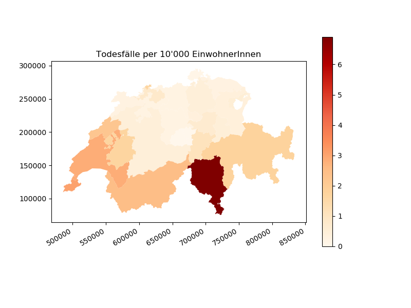{#Karte Tote pro Kanton }\

### Verlauf

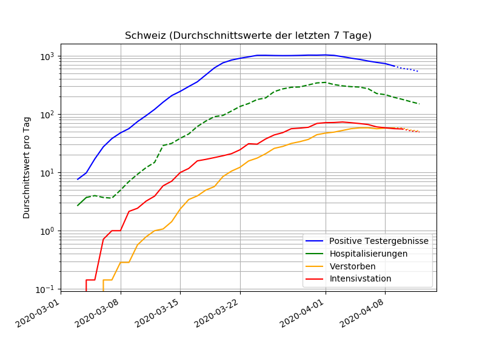{#Totale Anzahl }

{#Totale Anzahl }

## Entwicklung in den Kantonen

### Luzern

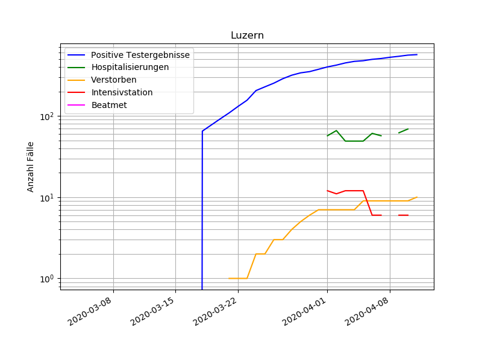\

### Aargau

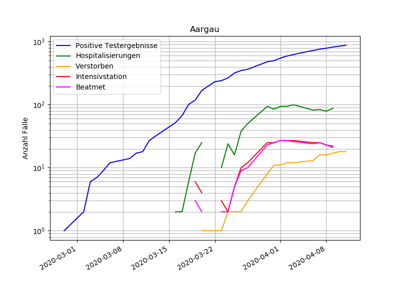\

### Basel-Stadt

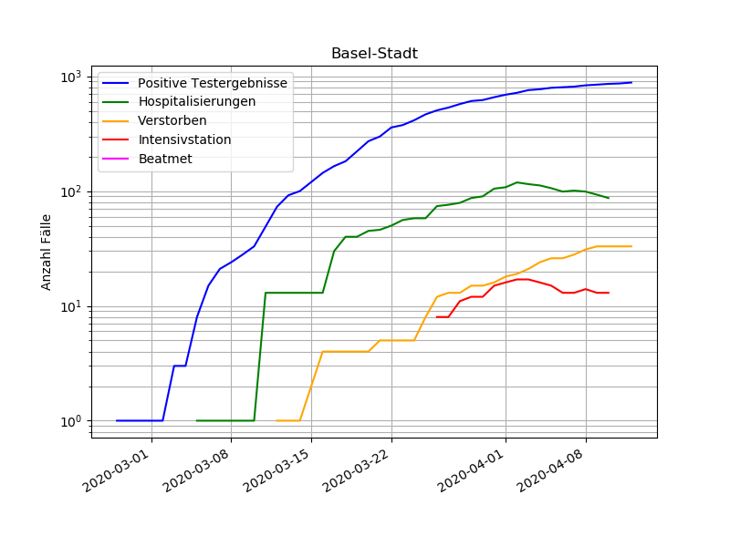\

### Basel-Land

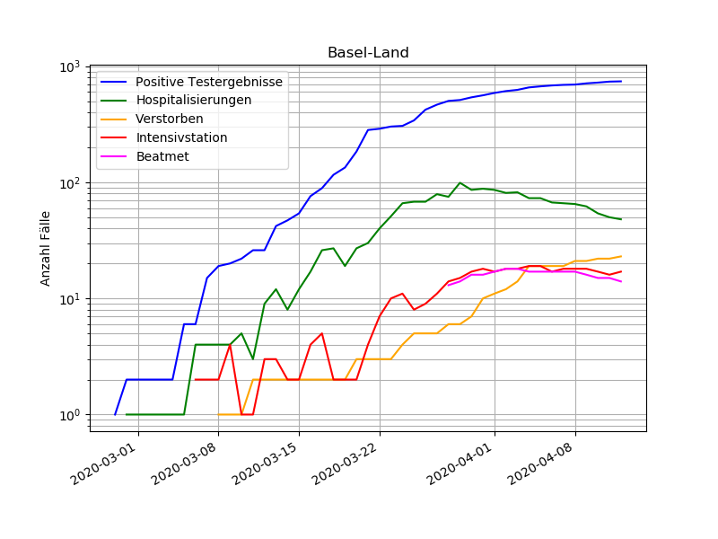\

### Bern

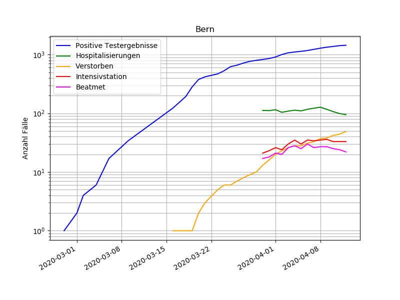\

### Zürich

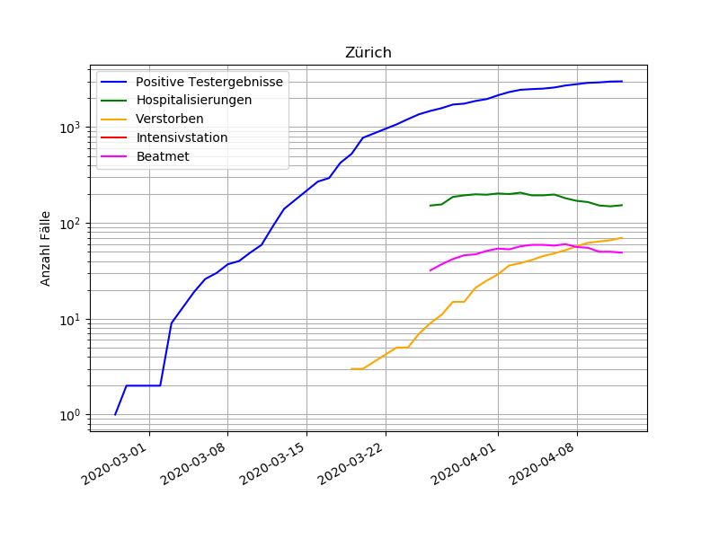\

### Graubünden

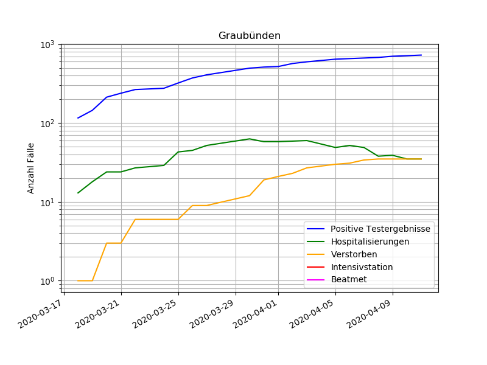\

### Wallis

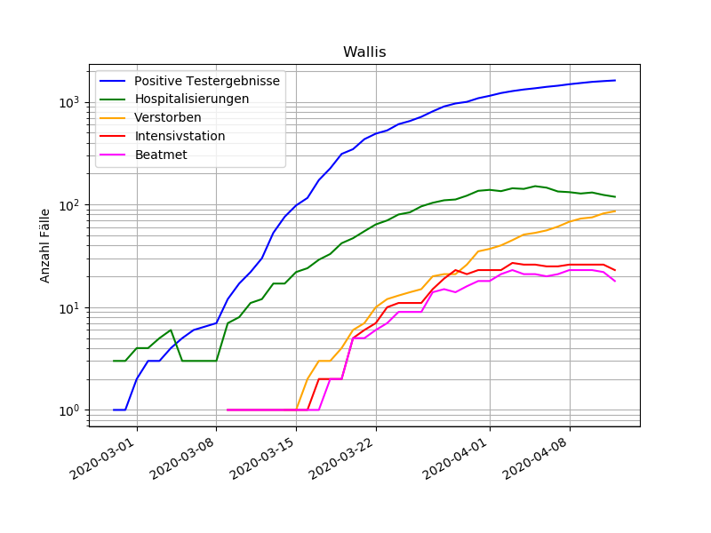\

### Genf

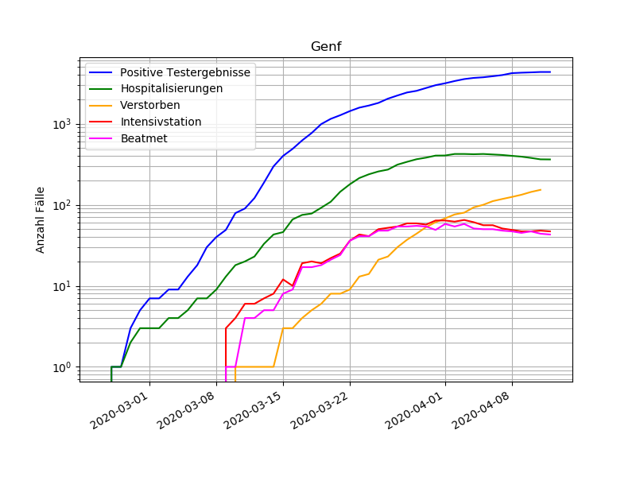\

### Waadt

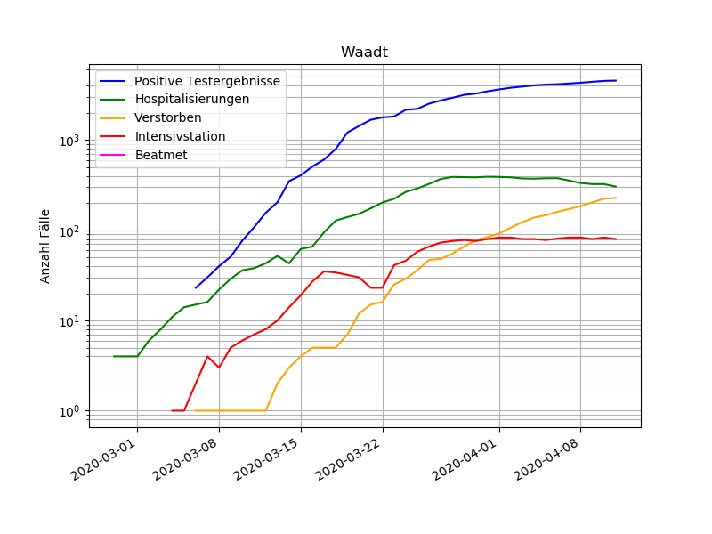\

### Tessin

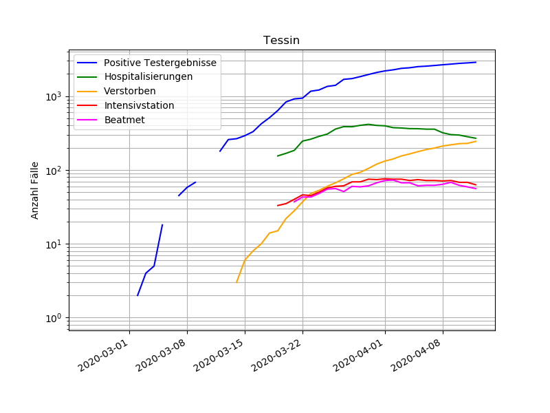\

## Quelle

Die Grafiken auf dieser Seite beruhen auf den Daten, welche durch das *Statistischen Amt des Kanton Zürichs* gesammelt und zur Verfügung gestellt werden. Die Daten findet ihr [hier](https://github.com/openZH/covid_19/blob/master/README.md).
